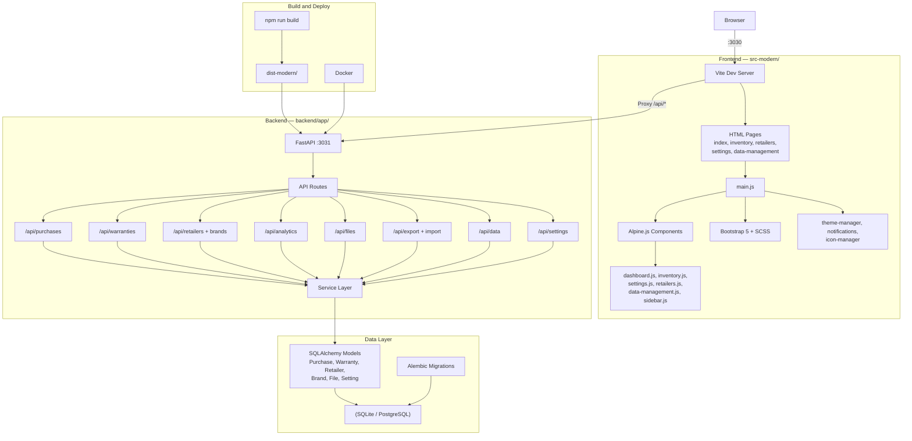

# Spends Tracker — Architecture Diagram

## Summary

- **Frontend**: Multi-page app with Alpine.js + Bootstrap 5, built by Vite. Pages for dashboard, inventory, retailers, settings, and data management.
- **Backend**: FastAPI with a clean Routes → Services → Models layered architecture. 8 API route groups.
- **Data**: SQLAlchemy ORM with 6 models (Purchase, Warranty, Retailer, Brand, File, Setting). SQLite in dev, PostgreSQL in prod. Migrations via Alembic.
- **Dev flow**: Vite (`:3030`) proxies `/api/*` to FastAPI (`:3031`). In production, FastAPI serves the built `dist-modern/` static files directly.
